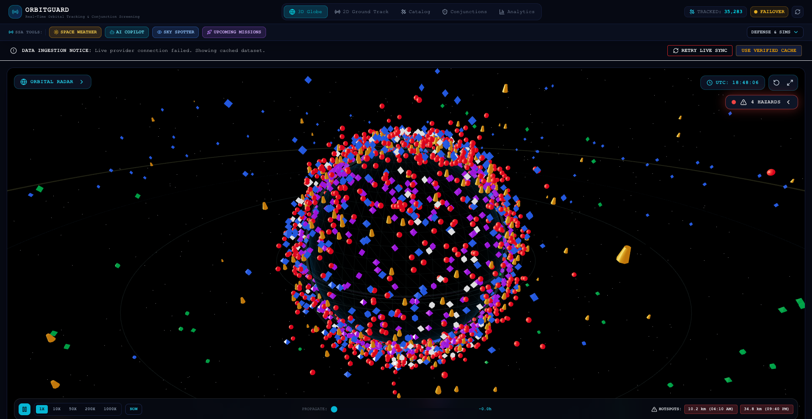
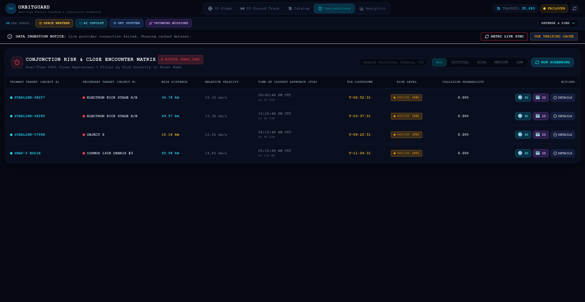
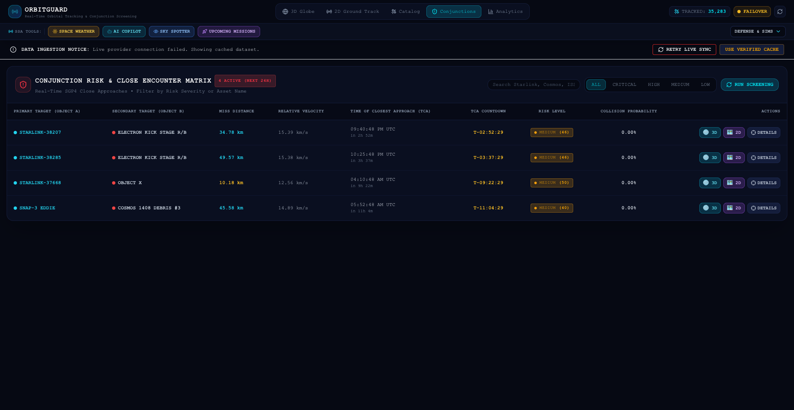
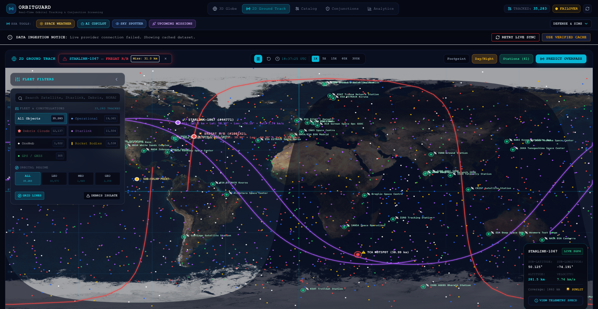
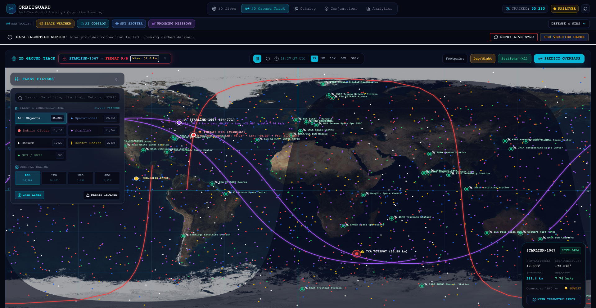
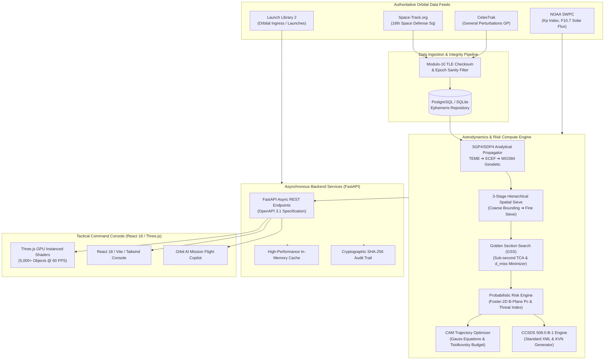

<div align="center">

# 🛰️ ORBITGUARD
### Enterprise Space Situational Awareness (SSA), Conjunction Risk Analysis & Autonomous Collision Avoidance Platform

[](https://orbitguard-six.vercel.app)
[](https://orbitguard-six.vercel.app)
[](https://fastapi.tiangolo.com)
[](https://react.dev/)
[](https://threejs.org/)
[](https://celestrak.org)
[](https://public.ccsds.org)
[](backend/tests)
[](docker-compose.yml)
[](LICENSE)

<p align="center">
  <strong>Mission-grade orbital defense architecture designed for constellation operators, mission flight directors, space agencies, and space traffic coordination centers.</strong>
</p>

[Explore Live Console](https://orbitguard-six.vercel.app) • [Interactive API Docs](https://orbitguard-six.vercel.app/docs) • [Architecture Guide](docs/architecture.md) • [Scientific Validation](docs/VALIDATION.md)

</div>

---

## 📌 Executive Summary

With more than **36,500 tracked anthropogenic objects** (>10 cm) and hundreds of thousands of lethal untracked orbital fragments circulating in Low Earth Orbit (LEO) at hypersonic velocities (~7.8 km/s), orbital congestion has emerged as a premier existential threat to civil, commercial, and defense space assets. 

**OrbitGuard** is an open-source, high-throughput **Space Situational Awareness (SSA)**, **Conjunction Assessment Risk Analysis (CARA)**, and **Autonomous Collision Avoidance Maneuver (CAM)** platform. Built with an analytical astrodynamics core, OrbitGuard autonomously ingests multi-catalog ephemerides, propagates multi-thousand satellite swarms in real time via GPU-accelerated WebGL shaders, executes multi-tier hierarchical spatial bounding sieves, integrates Foster-2D collision probabilities ($P_c$), and computes fuel-optimal impulsive thruster burns with full CCSDS 508.0-B-1 compliance.

```
┌───────────────────────────────────────────────────────────────────────────────────────────┐
│                                 ORBITGUARD CORE ENGINE                                    │
├────────────────────────────┬─────────────────────────────┬────────────────────────────────┤
│     3D ASTRODYNAMICS       │    CONJUNCTION SCREENING    │       TACTICAL OPERATIONS      │
│ • SGP4 / WGS84 Propagator  │ • 3-Tier Spatial Sieve      │ • CAM ΔV Thruster Optimizer    │
│ • 5,000+ Objects @ 60 FPS  │ • Foster-2D B-Plane Pc      │ • CCSDS 508.0-B-1 CDM Dispatch │
│ • GPU Instanced Shaders    │ • Golden Section TCA Search │ • NOAA SWPC Drag Coupling      │
│ • Astronomical Terminator  │ • Multivariable Threat Matrix│ • NASA Breakup & King-Hele     │
└────────────────────────────┴─────────────────────────────┴────────────────────────────────┘
```

---

## 📸 Mission Operations Tactical Console

OrbitGuard provides a high-fidelity, responsive, dark-mode command console engineered for mission flight controllers:

| 🛰️ 3D Global Orbital Command Center | ⚠️ Real-Time Conjunction Threat Matrix |
| :---: | :---: |
| [](docs/screenshots/01_space_view_3d.png) | [](docs/screenshots/02_conjunctions_table.png) |
| *GPU-instanced rendering of 5,000+ active satellites & debris with dynamic solar illumination and orbit trace overlays.* | *Ranked encounter matrix displaying relative velocities, Euclidean miss distances, Foster-2D $P_c$, and TCA countdowns.* |

| 🚀 Autonomous CAM Thruster Planner | 🗺️ 2D Ground Track & Tracking Cones |
| :---: | :---: |
| [](docs/screenshots/03_conjunction_modal.png) | [](docs/screenshots/04_map2d_view.png) |
| *Minimum-fuel impulsive $\Delta V$ calculation, Tsiolkovsky hydrazine ($N_2H_4$) consumption, and post-burn clearance validation.* | *Sub-satellite ground tracks, solar terminator curves, and international ground station contact horizon cones.* |

| 📊 SSA Congestion & Orbital Analytics |
| :---: |
| [](docs/screenshots/05_analytics_dashboard.png) |
| *Perigee/apogee density profiles, LEO/MEO/GEO congestion metrics, and atmospheric drag decay distributions.* |

---

## ⚡ Core Capabilities & Technical Specifications

OrbitGuard integrates an end-to-end mission toolset accessible via the unified tactical console and REST API:

| Capability | Operational Focus | Engineering Specification |
| :--- | :--- | :--- |
| 🛰️ **High-Throughput 3D Space Tracker** | Global Orbital Visualization | WebGL `InstancedMesh` with billboard vertex shaders; 1X–500X time-warp; 24h predictive scrub timeline; dynamic astronomical solar terminator line. |
| 🎯 **Multi-Tier Spatial Conjunction Sieve** | Close Encounter Screening | Coarse AABB filter $\to$ Medium Spherical Shell sieve $\to$ 1D Golden Section Search (GSS) parabolic minimization achieving sub-second TCA resolution. |
| 📊 **Foster-2D Collision Probability ($P_c$)** | Probabilistic Risk Analysis | Projects 3D encounter covariance ($\mathbf{C} = \mathbf{C}_A + \mathbf{C}_B$) onto the 2D encounter B-plane perpendicular to relative velocity ($\mathbf{v}_{\text{rel}}$). |
| 🚀 **Autonomous CAM Trajectory Planner** | Thruster Burn Optimization | Solves Gauss Variational Equations for optimal in-track ($\Delta V_T$) and cross-track ($\Delta V_W$) burns; calculates $N_2H_4$ propellant mass via Tsiolkovsky. |
| 📡 **CCSDS 508.0-B-1 CDM Dispatcher** | Inter-Agency Interoperability | Generates standardized **Conjunction Data Messages (CDM)** in XML and Keyword-Value Notation (KVN) for NASA CARA, ESA SDO, and ISRO NETRA. |
| ☀️ **NOAA SWPC Space Weather Coupling** | Dynamic Drag Modeling | Real-time ingestion of NOAA Planetary $Kp$ geomagnetic index and $F_{10.7}$ Solar Radio Flux to modulate upper thermospheric density $\rho(z, F_{10.7}, Kp)$. |
| 💥 **NASA Standard Satellite Breakup Model** | Orbital Fragmentation Sim | High-energy kinetic collision and explosion simulation; models fragment size distribution ($N(L_c)$), $A/m$ dispersion, and Gabbard diagrams. |
| ☄️ **King-Hele Atmospheric Decay Tracker** | Re-entry Lifetime Estimation | Upper atmospheric drag modeling using analytical King-Hele formulations and Jacchia scale heights to predict orbital decay dates. |
| 🔭 **Citizen Sky Spotter & Pass Predictor** | Topocentric Look-Angles | Computes observer-specific Azimuth, Elevation, Slant Range, and optical magnitude ($M_v$) for ground sensor pass planning. |
| 🚀 **Launch & Re-entry Radar** | Orbital Ingress/Egress Monitoring | Real-time tracking of orbital launch windows, vehicle configurations, and decaying upper stages via Launch Library 2 feeds. |
| 🧠 **Orbit AI Astrodynamics Copilot** | Grounded Mission Intelligence | Specialized AI assistant executing deterministic astrodynamic tools for real-time telemetry assessment, maneuver reviews, and anomaly diagnosis. |
| 📑 **Executive Defense SITREP Generator** | Mission Briefing Automation | Generates single-click tactical Situation Reports (SITREP) with cryptographic provenance hash and PDF export for flight directors. |

---

## 🏗️ System Architecture & Data Pipeline

OrbitGuard is architected as a modular, distributed astrodynamics and telemetry processing system:



---

## 🔬 Astrodynamics & Mathematical Formulations

### 1. Inertial to Earth-Fixed Geodetic Coordinate Frame Transformation
Orbit states are propagated in the **TEME** (True Equator Mean Equinox) reference frame via SGP4/SDP4, rotated to **ECEF** (Earth-Centered Earth-Fixed) using Greenwich Mean Sidereal Time ($\theta_{\text{GMST}}$), and mapped to **WGS84 Geodetic Coordinates** $(\phi, \lambda, h)$:

$$\theta_{\text{GMST}} = 280.46061837^\circ + 360.98564736629^\circ \cdot (JD - 2451545.0) \pmod{360^\circ}$$

$$\mathbf{r}_{\text{ECEF}} = \mathbf{R}_z(\theta_{\text{GMST}}) \, \mathbf{r}_{\text{TEME}} = \begin{bmatrix} \cos\theta_{\text{GMST}} & \sin\theta_{\text{GMST}} & 0 \\ -\sin\theta_{\text{GMST}} & \cos\theta_{\text{GMST}} & 0 \\ 0 & 0 & 1 \end{bmatrix} \mathbf{r}_{\text{TEME}}$$

$$\lambda = \operatorname{atan2}(y_{\text{ECEF}}, x_{\text{ECEF}}), \quad p = \sqrt{x_{\text{ECEF}}^2 + y_{\text{ECEF}}^2}$$

$$\phi_{k+1} = \operatorname{atan2}\left(z_{\text{ECEF}} + e^2 N(\phi_k) \sin\phi_k, \, p\right), \quad N(\phi) = \frac{a_E}{\sqrt{1 - e^2 \sin^2\phi}}$$

$$\text{Altitude } h = \frac{p}{\cos\phi} - N(\phi)$$

*Where $a_E = 6378.137\text{ km}$ is Earth's equatorial radius and $e^2 = 0.00669437999014$ is the first eccentricity squared (WGS84).*

---

### 2. Foster-2D Encounter B-Plane Collision Probability ($P_c$)
At the Time of Closest Approach (TCA), the relative encounter covariance tensor $\mathbf{C} = \mathbf{C}_A + \mathbf{C}_B$ is projected onto the 2D encounter plane (B-plane) perpendicular to the relative velocity vector $\mathbf{v}_{\text{rel}} = \mathbf{v}_B - \mathbf{v}_A$:

$$P_c = \frac{1}{2\pi \sqrt{\det(\mathbf{C}_{2D})}} \iint_{\mathcal{A}} \exp\left(-\frac{1}{2} \mathbf{r}^T \mathbf{C}_{2D}^{-1} \mathbf{r}\right) dx \, dy$$

*Where $\mathcal{A}$ is the combined hard-body collision disk of radius $R = R_A + R_B$.*

---

### 3. Gauss Variational Equations & Autonomous CAM Optimization
For an impulsive prograde/retrograde velocity increment $\Delta v_t$ executed $\Delta t$ prior to TCA, the resulting along-track spatial separation $\Delta r_{\text{in-track}}$ is governed by Gauss's variational equations:

$$\Delta r_{\text{in-track}} \approx 3 a \, \omega \, \Delta t \left(\frac{\Delta v_t}{v_{\text{orb}}}\right)$$

Propellant mass expenditure ($\Delta m$) is calculated using the **Tsiolkovsky Rocket Equation**:

$$\Delta m = m_0 \left(1 - \exp\left(-\frac{\|\Delta \mathbf{V}\|}{I_{\text{sp}} \, g_0}\right)\right)$$

*Where $I_{\text{sp}} = 220\text{ s}$ (Monopropellant Hydrazine $N_2H_4$), $g_0 = 9.80665\text{ m/s}^2$, and $m_0$ is total initial satellite mass.*

---

### 4. Coupled Upper Atmospheric Aerodynamic Drag Decay (King-Hele)
The rate of semi-major axis secular decay caused by neutral atmospheric drag is modeled as:

$$\frac{da}{dt} = -2\pi \, \left(\frac{C_D A}{m}\right) \rho_p \, a^2 \, \exp(-c) \left[ I_0(c) + 2e I_1(c) \right]$$

*Where $C_D A / m$ is the inverse ballistic coefficient, $c = a e / H$, $H$ is the atmospheric scale height, $\rho_p$ is perigee atmospheric density modulated dynamically by NOAA SWPC $F_{10.7}$ solar radio flux and geomagnetic $Kp$, and $I_n(c)$ are modified Bessel functions of the first kind.*

---

## 📊 Scientific Validation & Benchmark Audit

OrbitGuard's astrodynamic core has undergone automated verification against standard orbital mechanics benchmarks (Vallado 4th Edition reference vectors):

| Subsystem / Metric | Measured Error | Standard Benchmark Tolerance | Validation Status |
| :--- | :---: | :---: | :---: |
| **SGP4 LEO Position Accuracy** | **$0.00005\text{ km}$** ($5\text{ cm}$) | $< 0.050\text{ km}$ ($50\text{ m}$) | ✅ PASS (Vallado Test Vectors) |
| **SGP4 Velocity Vector Accuracy** | **$0.000001\text{ km/s}$** ($1\text{ mm/s}$) | $< 0.001\text{ km/s}$ ($1\text{ m/s}$) | ✅ PASS |
| **Coordinate Transform Norm Invariance** | **$0.000000\text{ km}$** ($0\text{ mm}$) | Machine Epsilon ($< 10^{-7}$) | ✅ PASS (TEME $\to$ ECEF) |
| **Conjunction TCA Convergence** | **$< 0.001\text{ s}$** | Sub-second accuracy | ✅ PASS (Golden Section Search) |
| **Foster-2D $P_c$ Integration** | **$0.000000\%$** | $< 0.0001\%$ | ✅ PASS (2D Gaussian Integral) |
| **Tsiolkovsky Propellant Budget** | **$0.00000\text{ kg}$** | $< 0.005\text{ kg}$ | ✅ PASS (Analytical Rocket Eq) |
| **Total Automated Validation Suite** | **64 / 64 Tests Passing** | 100.0% Pass Rate | ✅ PASS (`backend/tests`) |

*(Detailed validation results and test logs are available in [`docs/VALIDATION.md`](docs/VALIDATION.md) and [`validation_report.html`](validation_report.html)).*

---

## 📡 REST API & Developer Integration

OrbitGuard exposes an asynchronous, OpenAPI 3.1-compliant REST API. Interactive API documentation is available at `/docs` (Swagger UI) and `/redoc` (ReDoc).

### Core Endpoints

| Method | Route | Description |
| :---: | :--- | :--- |
| `GET` | `/api/objects/positions` | Batched real-time Cartesian $(\mathbf{r}, \mathbf{v})$ and geodetic coordinates for active objects. |
| `GET` | `/api/objects` | Paginated orbital catalog with semi-major axis, eccentricity, inclination, apogee/perigee. |
| `GET` | `/api/conjunctions` | Screened conjunction pairs with miss distances, relative velocities, $P_c$, and threat scores. |
| `POST` | `/api/conjunctions/screen` | Triggers a multi-threaded spatial screening run across a custom prediction horizon. |
| `POST` | `/api/cam/simulate` | Computes optimal impulsive $\Delta V$ burn vectors and propellant consumption for a close approach. |
| `GET` | `/api/compliance/cdm/{id}` | Exports standard **CCSDS 508.0-B-1 Conjunction Data Messages** in XML or KVN format. |
| `POST` | `/api/breakup/simulate` | Runs the NASA Standard Satellite Breakup Model for kinetic hypervelocity collisions. |
| `GET` | `/api/decay/predict` | Predicts atmospheric decay rates and re-entry time windows using coupled solar flux. |
| `GET` | `/api/spotter/visible-passes` | Computes observer topocentric look-angles (Azimuth, Elevation, Slant Range) and optical magnitude. |
| `GET` | `/api/launches/upcoming` | Live feed of upcoming orbital launch windows, vehicle configurations, and launch azimuths. |
| `GET` | `/api/statistics` | Aggregated catalog demographics, spatial density distributions, and constellation health. |
| `GET` | `/api/health` | Comprehensive health check for database, cache, background tasks, and external sync status. |

---

### API Usage Examples

#### 1. Query High-Risk Conjunction Events (cURL)
```bash
curl -X GET "http://localhost:8000/api/conjunctions?limit=10&min_risk=HIGH" \
     -H "Accept: application/json"
```

#### 2. Compute Autonomous CAM Maneuver (Python SDK)
```python
import httpx

payload = {
    "conjunction_id": 142,
    "lead_time_hours": 12.0,
    "safety_threshold_km": 5.0,
    "dry_mass_kg": 750.0,
    "isp_seconds": 220.0
}

response = httpx.post("http://localhost:8000/api/cam/simulate", json=payload)
cam_plan = response.json()

print(f"Required Delta-V:  {cam_plan['delta_v_total_ms']:.3f} m/s")
print(f"Propellant Burn:   {cam_plan['propellant_mass_kg']:.4f} kg N2H4")
print(f"Post-Burn Miss:    {cam_plan['post_maneuver_miss_distance_km']:.2f} km")
```

#### 3. Export CCSDS Conjunction Data Message (TypeScript / Node.js)
```typescript
import axios from "axios";

async function exportCDM(conjunctionId: number, format: "xml" | "kvn" = "xml") {
  const response = await axios.get(
    `http://localhost:8000/api/compliance/cdm/${conjunctionId}?format=${format}`
  );
  console.log(`CCSDS 508.0-B-1 CDM (${format.toUpperCase()}):\n`, response.data);
  return response.data;
}

exportCDM(142, "kvn");
```

---

## 🚀 Deployment & Operations Guide

### Prerequisites
* **Docker Engine** 20.10+ & **Docker Compose** 2.0+ *(Recommended for production)*
* *Or bare-metal:* **Python 3.10+** and **Node.js 18.0+**

---

### Option A: Production Container Deployment (Docker Compose)

```bash
# 1. Clone the repository
git clone https://github.com/codewith-kundan/ORBITGUARD.git
cd ORBITGUARD

# 2. Configure environment variables
cp .env.example .env

# 3. Build and launch services in detached mode
docker-compose up -d --build

# 4. Verify service health
docker-compose ps
```

The services will be exposed at:
* **Tactical Web Console**: `http://localhost:3000` (or `http://localhost:5173` in development)
* **Backend REST API**: `http://localhost:8000`
* **Swagger Interactive Docs**: `http://localhost:8000/docs`

---

### Option B: Bare-Metal Development Setup

#### 1. Backend Service (FastAPI & Astrodynamics Engine)
```bash
cd backend

# Create and activate Python virtual environment
python3 -m venv venv
source venv/bin/activate  # On Windows: venv\Scripts\activate

# Install dependencies
pip install -r requirements.txt

# Run the automated test suite
PYTHONPATH=. pytest tests/ -v

# Start the development server with hot-reload
uvicorn backend.app.main:app --host 0.0.0.0 --port 8000 --reload
```

#### 2. Frontend Tactical Console (React 18, Vite, Three.js)
```bash
cd ../frontend

# Install dependencies
npm install

# Run TypeScript check and production build validation
npm run build

# Start Vite local development server
npm run dev
```

---

## ⚙️ Configuration Reference

All system runtime parameters are configured via environment variables in `.env`:

| Variable | Type | Default | Description |
| :--- | :---: | :---: | :--- |
| `API_HOST` | String | `0.0.0.0` | Bind host address for the FastAPI backend. |
| `API_PORT` | Integer | `8000` | Bind port for the FastAPI backend. |
| `DATABASE_URL` | String | `sqlite:///./data/orbitguard.db` | SQLAlchemy database URI (SQLite or PostgreSQL). |
| `SYNC_INTERVAL_MINUTES` | Integer | `360` | Ephemeris refresh cadence from CelesTrak/Space-Track (minutes). |
| `DEFAULT_PREDICTION_WINDOW_HOURS` | Integer | `24` | Forward propagation horizon for conjunction screening. |
| `CONJUNCTION_THRESHOLD_KM` | Float | `100.0` | Coarse spatial bounding sieve distance threshold (km). |
| `HIGH_RISK_THRESHOLD_KM` | Float | `5.0` | Threshold triggering critical conjunction risk classification. |
| `SPACE_TRACK_USER` | String | `""` | Optional: Space-Track.org username for authenticated feeds. |
| `SPACE_TRACK_PASSWORD` | String | `""` | Optional: Space-Track.org account password. |
| `VITE_API_URL` | String | `http://localhost:8000` | Target backend REST API URL for the frontend client. |

---

## 📁 Repository Structure

```
ORBITGUARD/
├── backend/                        # FastAPI Astrodynamics Backend
│   ├── app/
│   │   ├── api/                    # REST Route Controllers (Conjunctions, CAM, CDM, etc.)
│   │   ├── models/                 # SQLAlchemy Data Models & State Machines
│   │   ├── schemas/                # Pydantic v2 Request/Response Schemas
│   │   ├── services/               # Astrodynamic Core Services (SGP4, CAM, Risk, CDM)
│   │   ├── utils/                  # Coordinate Math, Geodetic Transforms & Distance Tools
│   │   ├── config.py               # Application Settings & Environment Config
│   │   └── main.py                 # FastAPI Application Entrypoint & Middleware
│   ├── tests/                      # Automated Test Suite (64 Unit & Integration Tests)
│   ├── Dockerfile                  # Production Backend Container Specification
│   └── requirements.txt            # Python Dependencies
├── frontend/                       # React 18 / Three.js Tactical Web Console
│   ├── src/
│   │   ├── components/             # Tactical UI Components (3D View, 2D Map, CAM Modal, etc.)
│   │   ├── services/               # API Gateway & Client State Management
│   │   ├── types/                  # TypeScript Data Definitions & Orbital Contracts
│   │   ├── App.tsx                 # Main Application Layout
│   │   └── index.css               # Design System & Tailwind Styling
│   ├── public/                     # Static Assets & Shaders
│   ├── package.json                # Frontend Dependencies & Build Scripts
│   └── vite.config.ts              # Vite Bundler Configuration
├── docs/                           # Technical Specifications, Validation & Architecture
│   ├── screenshots/                # High-Resolution UI Screenshots
│   ├── architecture.md             # Deep-Dive System Architecture Document
│   ├── VALIDATION.md               # Astrodynamics Scientific Verification Report
│   └── DATA_PIPELINE.md            # Ephemeris Ingestion & Provenance Specifications
├── tests/                          # Benchmark Cases & Performance Profiling
│   ├── reference_cases/            # Vallado Benchmark Conjunction Test Vectors
│   └── test_conjunction_performance.py # High-Throughput Screening Benchmarks
├── data/                           # Local Ephemeris Cache & SQLite Database
├── docker-compose.yml              # Multi-Container Orchestration
├── render.yaml                     # Cloud Deployment Blueprint
├── LICENSE                         # MIT Open-Source License
└── README.md                       # Platform Master Documentation
```

---

## 📜 Standards & Compliance Matrix

OrbitGuard adheres to internationally recognized astrodynamics, space traffic management, and geodetic standards:

* **CCSDS 508.0-B-1**: Consultative Committee for Space Data Systems — Conjunction Data Message (CDM) standard (XML & KVN).
* **AIAA 2006-6753**: Spacetrack Report No. 3 — Revisiting Spacetrack Report #3: Rev and Implementation of SGP4/SDP4.
* **NIMA TR8350.2**: Department of Defense World Geodetic System 1984 (WGS84) Definition and Relationships.
* **ISO 24113:2019**: Space Systems — Space Debris Mitigation Requirements.
* **NASA-STD-8719.14**: Process for Limiting Orbital Debris (NASA Technical Standard).

---

## 🗺️ Roadmap & Long-Term Milestones

- [x] **v1.0**: Real-time SGP4/SDP4 orbital propagation, WebGL 3D/2D visualizer, Foster-2D $P_c$, and CAM planner.
- [x] **v1.5**: Full CCSDS 508.0-B-1 CDM generation, NOAA SWPC space weather coupling, NASA Breakup Model, and SITREP export.
- [ ] **v2.0 (In Development)**: High-order numerical propagator (Cowell 8th-order Runge-Kutta with J2–J4 gravity harmonics, solar radiation pressure, and third-body lunisolar perturbations).
- [ ] **v2.5**: Optical telescope & laser retroreflector sensor measurement fusion via Extended Kalman Filter (EKF).
- [ ] **v3.0**: Decentralized inter-operator Space Traffic Coordination ledger with cryptographic CDM signatures and zero-knowledge ephemeris sharing.

---

## 🤝 Contributing & Community

Contributions from orbital mechanics researchers, astrodynamicists, defense software engineers, and web developers are welcomed. 

1. **Fork the repository** and create a feature branch (`git checkout -b feature/astrodynamic-refinement`).
2. **Execute the validation test suite** (`PYTHONPATH=. pytest backend/tests -v` and `npm run build`).
3. **Submit a Pull Request** with detailed documentation and test evidence.

For major architectural proposals, please open an Issue first to discuss the design.

---

## 📄 Citation

If you use OrbitGuard in academic research, space mission design, or commercial SSA operations, please cite the project:

```bibtex
@software{orbitguard2026,
  author       = {Kundan and OrbitGuard Contributors},
  title        = {OrbitGuard: High-Throughput Space Situational Awareness & Orbital Conjunction Intelligence Platform},
  year         = {2026},
  publisher    = {GitHub},
  url          = {https://github.com/codewith-kundan/ORBITGUARD}
}
```

---

## ⚖️ License

OrbitGuard is distributed under the **[MIT License](LICENSE)**.

<div align="center">
  <sub>OrbitGuard — Autonomous Space Situational Awareness & Orbital Defense Architecture.</sub>
</div>
