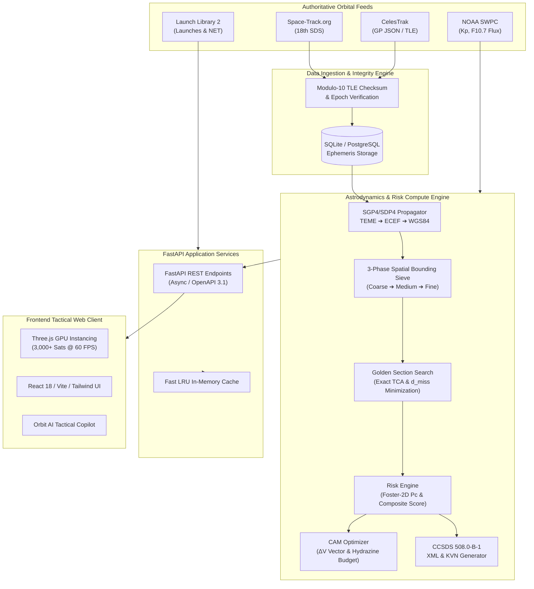

# 🛰️ ORBITGUARD

### High-Throughput Space Situational Awareness (SSA) & Orbital Conjunction Intelligence Platform

[](https://orbitguard-six.vercel.app)
[](https://orbitguard-six.vercel.app)
[](https://fastapi.tiangolo.com)
[](https://react.dev/)
[](https://threejs.org/)
[](https://celestrak.org)
[](https://public.ccsds.org)
[](backend/tests)
[](LICENSE)

---

**OrbitGuard** is an open-source, high-throughput **Space Situational Awareness (SSA)**, **Conjunction Assessment Risk Analysis (CARA)**, and **Autonomous Collision Avoidance Maneuver (CAM)** platform. Designed for satellite constellation operators, mission flight directors, space agencies, and defense analysts, OrbitGuard continuously ingests orbital ephemerides, propagates multi-thousand satellite swarms in real time via GPU-accelerated WebGL, screens high-risk close approaches using spatial sieves, and optimizes collision-mitigation thruster burns.

---

## 📌 Table of Contents
- [1. Executive System Overview](#-1-executive-system-overview)
- [2. Platform Capabilities & Toolset](#-2-platform-capabilities--toolset)
- [3. System Architecture & Data Pipeline](#-3-system-architecture--data-pipeline)
- [4. Astrodynamics & Mathematical Formulations](#-4-astrodynamics--mathematical-formulations)
- [5. Visual Interface & Telemetry Views](#-5-visual-interface--telemetry-views)
- [6. REST API & Data Standards](#-6-rest-api--data-standards)
- [7. Deployment & Operations Guide](#-7-deployment--operations-guide)
- [8. Configuration Reference](#-8-configuration-reference)
- [9. Testing & Astrodynamic Verification](#-9-testing--astrodynamic-verification)
- [10. Data Standards & Compliance](#-10-data-standards--compliance)
- [11. Contributing & License](#-11-contributing--license)

---

## 🌌 1. Executive System Overview

With over **36,500 cataloged orbital debris objects** (>10 cm) and hundreds of thousands of untracked fragments traveling at hypersonic orbital velocities (~7.8 km/s in Low Earth Orbit), orbital congestion presents an escalating operational risk to commercial mega-constellations and scientific missions.

OrbitGuard provides an integrated, automated telemetry and collision screening pipeline:

```
┌─────────────────────────────────────────────────────────────────────────────────────────┐
│                                ORBITGUARD CORE ENGINE                                   │
├──────────────────────────┬─────────────────────────────┬────────────────────────────────┤
│    3D ASTRODYNAMICS      │   CONJUNCTION SCREENING     │       MISSION OPERATIONS       │
│ • SGP4 / WGS84 Propagator│ • 3-Tier Spatial Sieve      │ • CAM ΔV Burn Optimizer        │
│ • 3,000–5,000 Sats @ 60fps│ • Foster-2D B-Plane Pc     │ • CCSDS 508.0-B-1 CDM Exporter │
│ • GPU Instanced Shaders  │ • Golden Section TCA Search │ • NOAA Space Weather Coupled   │
│ • Custom Solar Terminator│ • Real-time Risk Scoring    │ • NASA Breakup & Decay Models  │
└──────────────────────────┴─────────────────────────────┴────────────────────────────────┘
```

### Key Operational Capabilities
* **Real-Time Ephemeris Ingestion**: Live automated synchronization with Space-Track.org (18th Space Defense Squadron) and CelesTrak General Perturbations (GP) feeds with Modulo-10 TLE checksum validation.
* **GPU-Accelerated 3D WebGL Visualization**: Renders up to 5,000 orbital bodies simultaneously at 60 FPS using instanced vertex shaders and custom lighting models with dynamic astronomical solar terminator lines.
* **High-Precision Conjunction Screening**: Employs coarse-to-fine hierarchical spatial bounding boxes followed by Golden Section Search one-dimensional minimization to isolate exact Time of Closest Approach (TCA) and minimum miss distance ($d_{\text{miss}}$).
* **Autonomous Collision Avoidance Planning (CAM)**: Solves for minimum-fuel impulsive $\Delta V$ maneuvers (prograde/retrograde and out-of-plane cross-track) and calculates Monopropellant Hydrazine ($N_2H_4$) mass expenditure via the Tsiolkovsky Rocket Equation.
* **Standardized Agency Interoperability**: Generates fully compliant **CCSDS 508.0-B-1 Conjunction Data Messages (CDM)** in both XML and Keyword-Value Notation (KVN) for inter-operator coordination (NASA CARA, ESA Space Debris Office, ISRO NETRA).

---

## ⚡ 2. Platform Capabilities & Toolset

OrbitGuard integrates a modular suite of mission tools accessible via the unified tactical console:

| Module | Operational Focus | Technical Specification |
| :--- | :--- | :--- |
| 🛰️ **3D Space Tracker** | Global Orbital Visualization | WebGL `InstancedMesh` with billboard shaders, 1X–500X time warp, 24h predictive scrub timeline, Day/Night solar illumination. |
| 🗺️ **2D Ground Track & Coverage** | Geographic Footprint Analysis | Sub-satellite tracks, terminator line, ground station visibility cones (Svalbard, Diego Garcia, Thule, Cape Canaveral, Hartebeesthoek). |
| ⚠️ **Conjunction Assessment** | Close Encounter Matrix | Sortable table of active conjunctions with Euclidean miss distance ($d_{\text{miss}}$), relative velocity ($\mathbf{v}_{\text{rel}}$), Foster-2D $P_c$, and composite risk index. |
| 🚀 **CAM Thruster Planner** | Collision Avoidance Maneuver | Impulsive burn vector calculation ($\Delta V_T, \Delta V_N, \Delta V_W$), propellant mass consumption ($\Delta m$), and post-maneuver miss distance verification. |
| 📄 **CCSDS CDM Dispatcher** | Inter-Agency Coordination | Generates standardized CCSDS 508.0-B-1 Conjunction Data Messages in XML / KVN formats with state vectors and covariance. |
| 🎬 **Cinematic Replay** | 4D Encounter Reconstruction | Time-stepped 3D encounter replay displaying relative velocity vectors, miss vector geometry, and closest approach animations. |
| ☀️ **NOAA Space Weather** | Atmospheric Drag Coupling | Real-time monitoring of NOAA SWPC Planetary $Kp$ geomagnetic index and $F_{10.7}$ Solar Radio Flux for LEO thermospheric density adjustments. |
| 💥 **NASA Breakup Model** | Orbital Fragmentation Sim | Standard Satellite Breakup Model modeling kinetic hypervelocity impacts, fragment dispersion, and Gabbard diagram distributions. |
| ☄️ **Atmospheric Decay Tracker** | Orbital Lifetime Estimation | Ballistic coefficient calculation, Jacchia/King-Hele drag modeling, and re-entry date prediction. |
| 🚀 **Launch & Re-entry Radar** | Global Traffic Monitoring | Real-time tracking of upcoming orbital launches (Launch Library 2 API), launch azimuths, and decaying stages. |
| 👁️ **Citizen Sky Spotter** | Topocentric Look-Angles | Computes observer-specific azimuth, elevation, and visual magnitude for ground-based satellite tracking. |
| 🧠 **Orbit AI Copilot** | Specialized Astrodynamics LLM | Embedded assistant providing real-time telemetry analysis, orbital mechanics calculations, and compliance insights. |
| 📑 **Executive Defense SITREP** | Tactical Safety Dossier | Automated single-click intelligence summary generator with PDF export for mission flight directors. |

---

## 🏗️ 3. System Architecture & Data Pipeline



---

## 🔬 4. Astrodynamics & Mathematical Formulations

### 1. Coordinate Frame Transformations
Orbital positions are propagated using **SGP4/SDP4** in the **TEME** (True Equator Mean Equinox) inertial reference frame, converted to **ECEF** (Earth-Centered Earth-Fixed) via Greenwich Mean Sidereal Time ($\theta_{\text{GMST}}$), and mapped to **WGS84 Geodetic** coordinates $(\phi, \lambda, h)$:

$$\theta_{\text{GMST}} = 280.46061837^\circ + 360.98564736629^\circ \cdot (JD - 2451545.0) \pmod{360^\circ}$$

$$\mathbf{r}_{\text{ECEF}} = \mathbf{R}_z(\theta_{\text{GMST}}) \, \mathbf{r}_{\text{TEME}}$$

### 2. Foster-2D Collision Probability ($P_c$)
When positional covariance matrices ($\mathbf{C}_A, \mathbf{C}_B$) are defined at the Time of Closest Approach (TCA), the relative encounter covariance $\mathbf{C} = \mathbf{C}_A + \mathbf{C}_B$ is projected onto the 2D encounter plane (B-plane) perpendicular to relative velocity $\mathbf{v}_{\text{rel}}$:

$$P_c = \frac{1}{2\pi \sqrt{\det(\mathbf{C}_{2D})}} \iint_{\mathcal{A}} \exp\left(-\frac{1}{2} \mathbf{r}^T \mathbf{C}_{2D}^{-1} \mathbf{r}\right) dx \, dy$$

*Where $\mathcal{A}$ is the combined hard-body collision cross-section disk of radius $R = R_A + R_B$.*

### 3. Impulsive Collision Avoidance Maneuver (CAM)
For an impulsive in-track velocity increment $\Delta v_{\text{prograde}}$ executed $\Delta t$ prior to TCA, the secular along-track position separation $\Delta r_{\text{in-track}}$ is governed by Gauss's variational equations:

$$\Delta r_{\text{in-track}} \approx 3 a \, \omega \, \Delta t \left(\frac{\Delta v_{\text{prograde}}}{v_{\text{orb}}}\right)$$

Propellant mass consumption ($\Delta m$) is calculated using the **Tsiolkovsky Rocket Equation**:

$$\Delta m = m_0 \left(1 - \exp\left(-\frac{\Delta V}{I_{\text{sp}} \, g_0}\right)\right)$$

*Where $I_{\text{sp}} = 220\text{ s}$ (standard Monopropellant Hydrazine $N_2H_4$) and $g_0 = 9.80665\text{ m/s}^2$.*

### 4. Atmospheric Drag & Lifetime Modeling (King-Hele)
The rate of semi-major axis decay due to upper atmospheric aerodynamic drag is modeled as:

$$\frac{da}{dt} = -2\pi \, \left(\frac{C_D A}{m}\right) \rho_p \, a^2 \, \exp(-c) \left[ I_0(c) + 2e I_1(c) \right]$$

*Where $C_D A / m$ is the inverse ballistic coefficient, $\rho_p$ is atmospheric density at perigee modulated by the NOAA $F_{10.7}$ flux index, and $I_n(c)$ are modified Bessel functions of the first kind.*

---

## 🖥️ 5. Visual Interface & Telemetry Views

OrbitGuard provides a responsive, dark-mode tactical interface built with React, Vite, and Three.js:

| View | Description |
| :--- | :--- |
| **3D Global Space View** | Real-time WebGL rendering of 3,000+ active satellites and debris swarms with color-coded classification, orbit trails, and lighting. |
| **2D Ground Track & Footprints** | Real-time cylindrical projection with sub-satellite points, day/night terminator curves, and ground station visibility cones. |
| **Conjunction Assessment Table** | Ranked threat matrix with miss distance, relative velocity, time-to-TCA countdown, and one-click CAM/CDM actions. |
| **CAM Trajectory Optimizer** | Interactive maneuver planner calculating required $\Delta V$ vectors, burn direction, and fuel budget. |
| **Analytics & SSA Dashboard** | Population breakdowns across LEO/MEO/GEO, altitude density distributions, and historical conjunction frequency metrics. |

*(High-resolution screenshots are available in [`docs/screenshots/`](docs/screenshots/)).*

---

## 📡 6. REST API & Data Standards

The backend exposes a fully typed, asynchronous REST API compliant with OpenAPI 3.1:

### Core Endpoints

| Method | Endpoint | Description |
| :---: | :--- | :--- |
| `GET` | `/api/objects/positions` | Batched real-time Cartesian $(\mathbf{r}, \mathbf{v})$ and geodetic coordinates for all active objects. |
| `GET` | `/api/objects` | Paginated catalog with orbital elements (semi-major axis, eccentricity, inclination, apogee/perigee). |
| `GET` | `/api/conjunctions` | Screened conjunction pairs with miss distances, relative velocities, and risk scores. |
| `POST` | `/api/conjunctions/screen` | Triggers a multi-threaded spatial screening run across a custom prediction window and threshold. |
| `POST` | `/api/cam/simulate` | Computes optimal impulsive $\Delta V$ burn vectors and propellant consumption for a conjunction pair. |
| `GET` | `/api/compliance/cdm/{id}` | Exports standard **CCSDS 508.0-B-1 Conjunction Data Messages** in XML or KVN format. |
| `GET` | `/api/spotter/visible-passes` | Computes observer topocentric look-angles (Azimuth, Elevation, Slant Range) and visual magnitude. |
| `GET` | `/api/launches/upcoming` | Live feed of upcoming orbital launch windows, vehicle configurations, and launch sites. |
| `GET` | `/api/statistics` | Aggregated catalog statistics, spatial density distributions, and operational threat levels. |
| `GET` | `/api/health` | Comprehensive system health check including database, cache, and external sync status. |

### API Usage Example (cURL & Python)

```bash
# Query active conjunctions with miss distance under 5.0 km
curl -X GET "http://localhost:8000/api/conjunctions?limit=10&min_risk=MEDIUM" \
     -H "Accept: application/json"
```

```python
import httpx

# Request CAM burn optimization for a specific conjunction event
payload = {
    "conjunction_id": 142,
    "lead_time_hours": 12.0,
    "safety_threshold_km": 5.0,
    "dry_mass_kg": 750.0,
    "isp_seconds": 220.0
}

response = httpx.post("http://localhost:8000/api/cam/simulate", json=payload)
cam_plan = response.json()

print(f"Required Delta-V: {cam_plan['delta_v_total_ms']:.3f} m/s")
print(f"Propellant Burn:  {cam_plan['propellant_mass_kg']:.4f} kg N2H4")
print(f"New Miss Distance: {cam_plan['post_maneuver_miss_distance_km']:.2f} km")
```

Interactive API documentation is available at `/docs` (Swagger UI) and `/redoc` (ReDoc).

---

## 🚀 7. Deployment & Operations Guide

### Prerequisites
* **Docker Engine** 20.10+ & **Docker Compose** 2.0+ *(recommended)*
* *Or bare-metal:* **Python 3.10+** and **Node.js 18.0+**

---

### Option A: Docker Deployment (Recommended)

```bash
# 1. Clone repository
git clone https://github.com/codewith-kundan/ORBITGUARD.git
cd ORBITGUARD

# 2. Configure environment
cp .env.example .env

# 3. Build and launch containers
docker-compose up -d --build

# 4. Verify running containers
docker-compose ps
```

The services will be available at:
* **Frontend Web Console**: `http://localhost:3000` (or `http://localhost:5173` in dev mode)
* **Backend REST API**: `http://localhost:8000`
* **Swagger API Docs**: `http://localhost:8000/docs`

---

### Option B: Bare-Metal Development Setup

#### 1. Backend Service (FastAPI & SGP4)
```bash
cd backend

# Create and activate Python virtual environment
python3 -m venv venv
source venv/bin/activate  # On Windows: venv\Scripts\activate

# Install dependencies
pip install -r requirements.txt

# Run automated test suite
pytest tests/ -v

# Launch the backend server
uvicorn backend.app.main:app --host 0.0.0.0 --port 8000 --reload
```

#### 2. Frontend Web Console (React, Vite, Three.js)
```bash
cd ../frontend

# Install dependencies
npm install

# Run type check and production build verification
npm run build

# Start Vite development server
npm run dev
```

---

## ⚙️ 8. Configuration Reference

All system configuration is managed via environment variables defined in `.env`:

| Variable | Type | Default | Description |
| :--- | :---: | :---: | :--- |
| `API_HOST` | String | `0.0.0.0` | Bind host address for FastAPI backend. |
| `API_PORT` | Integer | `8000` | Bind port for FastAPI backend. |
| `DATABASE_URL` | String | `sqlite:///./data/orbitguard.db` | SQLAlchemy connection string (SQLite or PostgreSQL). |
| `SYNC_INTERVAL_MINUTES` | Integer | `360` | Ephemeris refresh cadence from CelesTrak/Space-Track (hours). |
| `DEFAULT_PREDICTION_WINDOW_HOURS` | Integer | `24` | Default forward propagation window for conjunction screening. |
| `CONJUNCTION_THRESHOLD_KM` | Float | `100.0` | Coarse spatial bounding box sieve distance (km). |
| `HIGH_RISK_THRESHOLD_KM` | Float | `5.0` | Threshold triggering critical collision risk classification. |
| `SPACE_TRACK_USER` | String | `""` | Optional: Space-Track.org login username for authenticated feeds. |
| `SPACE_TRACK_PASSWORD` | String | `""` | Optional: Space-Track.org login password. |
| `VITE_API_URL` | String | `http://localhost:8000` | Frontend API gateway target URL. |

---

## 🧪 9. Testing & Astrodynamic Verification

OrbitGuard maintains an automated test suite covering propagation accuracy, spatial screening algorithms, CAM calculations, and API endpoints:

```bash
cd backend
pytest tests/ -v
```

### Verification Matrix
* ✅ **SGP4 Ephemeris Propagation**: Verified against standard NORAD TLE propagation test vectors.
* ✅ **Spatial Sieve & Minimization**: Verified coarse-to-fine convergence on minimum Euclidean miss distance.
* ✅ **Foster-2D Probability Integral**: Verified against synthetic 2D Gaussian B-plane encounter geometries.
* ✅ **Tsiolkovsky Propellant Calculations**: Validated against analytical rocket equation benchmarks.
* ✅ **CCSDS 508.0-B-1 Schema Validation**: Verified XML and KVN formatting against CCSDS Blue Book standards.
* ✅ **REST API Endpoints**: End-to-end integration tests across all route handlers.

---

## 📜 10. Data Standards & Compliance

* **CCSDS 508.0-B-1**: Conjunction Data Message (CDM) standard for civil and military space traffic management data exchange.
* **SGP4 / SDP4 (AIAA 2006-6753)**: Simplified General Perturbations satellite orbit propagation model.
* **WGS84 (NIMA TR8350.2)**: World Geodetic System 1984 Earth gravitational and reference ellipsoid model.
* **TEME Coordinate System**: True Equator Mean Equinox coordinate reference frame.
* **Modulo-10 Checksum Algorithm**: Standard NORAD Two-Line Element set line-integrity validation.

---

## 🤝 11. Contributing & License

Contributions from aerospace engineers, astrodynamicists, and software developers are welcomed. Please review our guidelines:

1. **Fork the repository** and create a feature branch (`git checkout -b feature/astrodynamic-enhancement`).
2. **Ensure all test suites pass** (`pytest tests/ -v` and `npm run build`).
3. **Submit a Pull Request** with detailed documentation of your changes.

### License
OrbitGuard is released under the **[MIT License](LICENSE)**.

---

<p align="center">
  <sub>OrbitGuard — Real-Time Space Situational Awareness & Orbital Defense Architecture.</sub>
</p>
