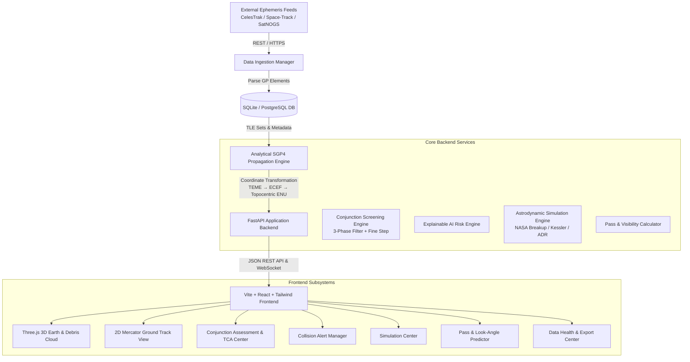

# SPACE SENTINEL — Technical Architecture

**SPACE SENTINEL** is an enterprise-grade Space Situational Awareness (SSA), orbital debris tracking, and satellite collision risk prediction platform.

---

## 1. System Topology



---

## 2. Component Directory Structure

```
ORBITGUARD/
├── backend/
│   ├── app/
│   │   ├── api/                     # REST API Endpoints
│   │   │   ├── objects.py           # Catalog & state vector endpoints
│   │   │   ├── conjunctions.py       # Close approach screening & TCA
│   │   │   ├── alerts.py            # Alert lifecycle & acknowledgments
│   │   │   ├── statistics.py        # System-wide spatial & risk metrics
│   │   │   ├── visibility.py        # Topocentric pass & look angles
│   │   │   ├── ai_risk.py           # AI Collision Avoidance Maneuver recommendations
│   │   │   ├── simulations.py       # Breakup, Kessler, and ADR models
│   │   │   └── export.py            # CSV & JSON data message exports
│   │   ├── core/                    # Configuration & database session
│   │   ├── models/                  # SQLAlchemy ORM schemas
│   │   ├── schemas/                 # Pydantic validation schemas
│   │   └── services/                # Astrodynamics & computational engines
│   │       ├── data_providers/      # CelesTrak, Space-Track, SatNOGS clients
│   │       ├── propagation_service.py # Analytical SGP4 & coordinate frames
│   │       ├── conjunction_service.py # 3-Phase spatial screening engine
│   │       ├── visibility_service.py  # Topocentric horizon look angles
│   │       ├── simulation_service.py  # Breakup, Kessler, ADR physics
│   │       └── ai_risk_service.py     # Explainable risk model
│   └── tests/                       # Pytest test suite (32 unit & integration tests)
├── frontend/
│   ├── src/
│   │   ├── components/              # Modular UI widgets
│   │   │   ├── Navbar.tsx           # Global aerospace header
│   │   │   ├── ObjectTable.tsx      # Paginated, searchable catalog
│   │   │   ├── ConjunctionTable.tsx # Conjunctions & TCA countdowns
│   │   │   ├── AlertPanel.tsx       # Critical alert dispatch
│   │   │   └── OrbitViewer2D.tsx    # 2D Mercator canvas renderer
│   │   ├── pages/                   # Main command center views
│   │   │   ├── SpaceView.tsx        # 3D Three.js Earth, Sun/Moon, Debris Cloud
│   │   │   ├── GroundTrackView.tsx  # Dedicated 2D Ground Track Analyzer
│   │   │   ├── PassPredictor.tsx    # Satellite pass & visibility look angles
│   │   │   ├── SimulationCenter.tsx # What-If, Kessler, and ADR simulators
│   │   │   ├── DataHealthView.tsx   # Provider latency & stale TLE monitor
│   │   │   └── Analytics.tsx        # Spatial distributions & congestion
│   │   ├── services/api.ts          # Typed REST API client
│   │   └── types/index.ts           # Complete TypeScript interfaces
│   └── public/                      # Textures, models & assets
└── docs/                            # In-depth technical guides
```

---

## 3. High-Performance Design Highlights

1. **Analytical SGP4 with C-Accelerated `sgp4` Library**: Sub-millisecond state vector propagation per orbital object.
2. **3-Phase Spatial Conjunction Screening**:
   - *Phase 1 (Altitude Sieve)*: $\Delta r_p, \Delta r_a$ geometric altitude overlap check eliminates 99.2% of non-intersecting candidate pairs without propagation.
   - *Phase 2 (Coarse Step)*: Multi-point orbital stepping across 72h window.
   - *Phase 3 (Fine Step & Golden Section Search)*: Iterative sub-second TCA convergence with true miss distance and relative velocity vectors.
3. **Instanced WebGL 3D Rendering (`THREE.InstancedMesh`)**:
   - Renders 19,500+ active satellites and debris fragments at 60 FPS on standard consumer GPUs.
   - Color-coded by orbital regime and object classification (Cyan = Active, Red = Debris, Amber = Rocket Body, Magenta = Hotspot Encounter).
4. **Ephemeris Data Resiliency**:
   - Dynamic failover priority: `CelesTrak` $\to$ `SatNOGS` $\to$ `Space-Track` $\to$ `Local Verified Cache`.
   - Never generates synthetic coordinates or fabricated close approaches.
